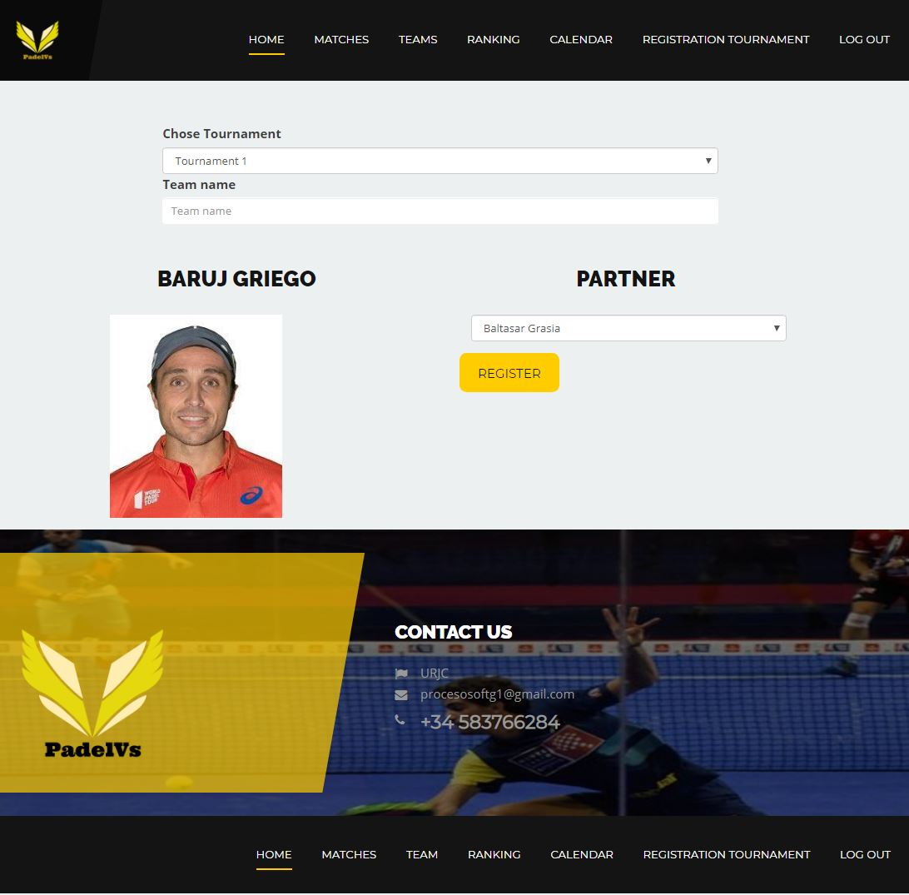
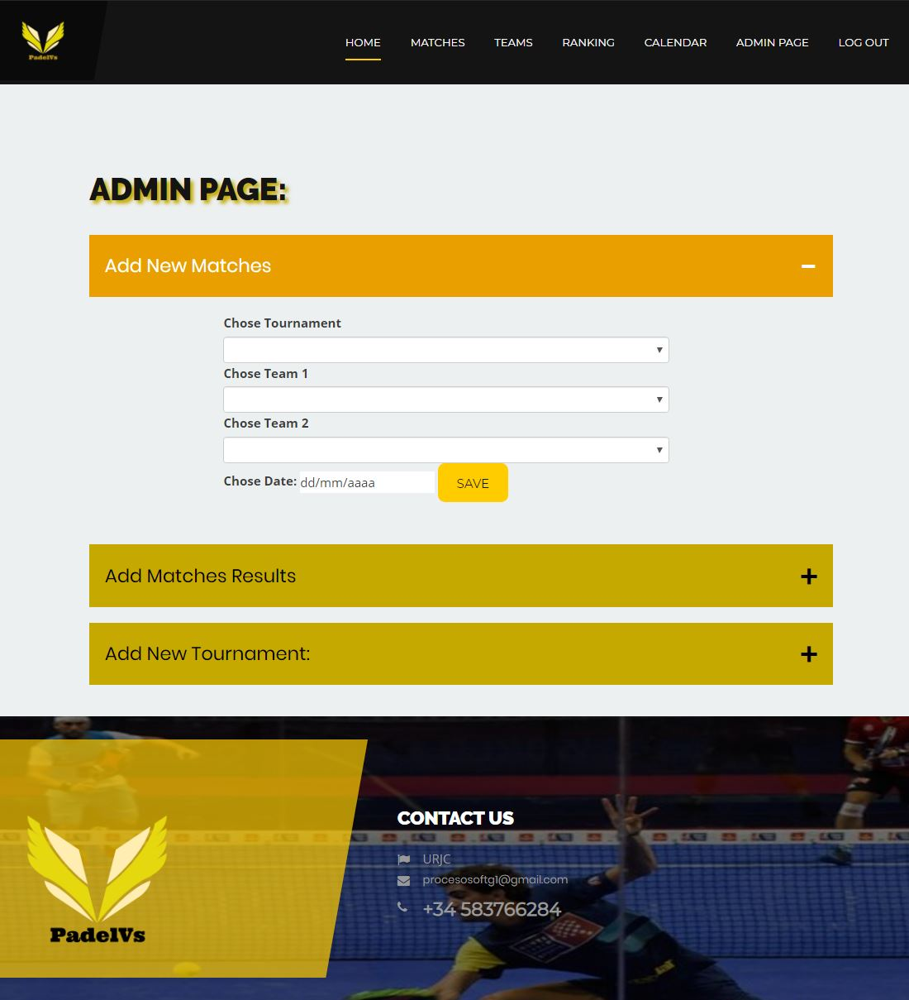
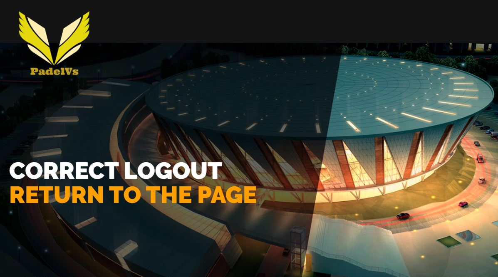
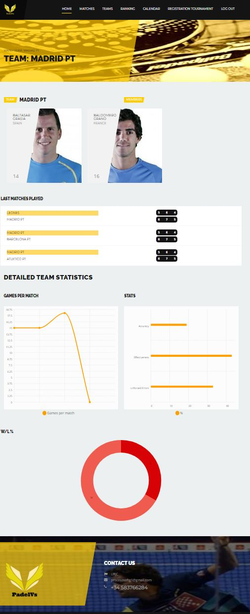
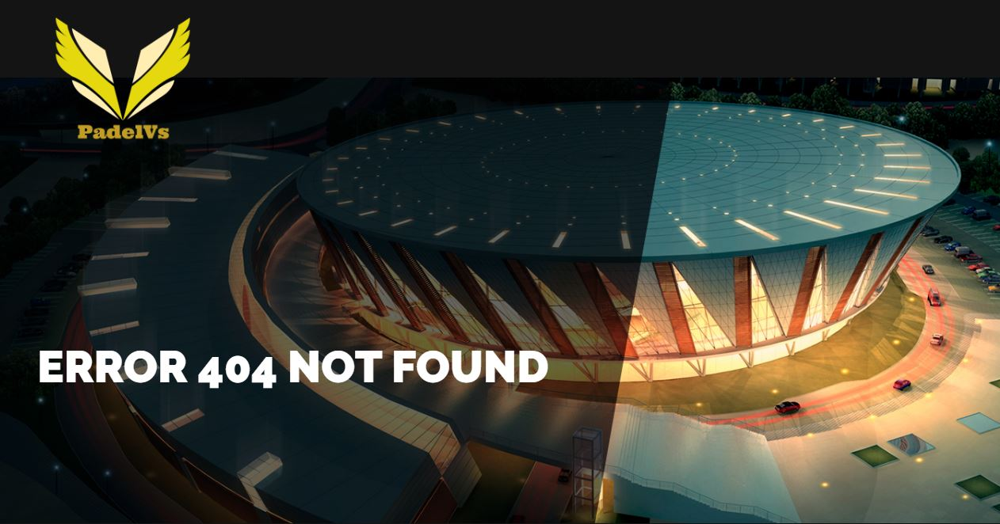
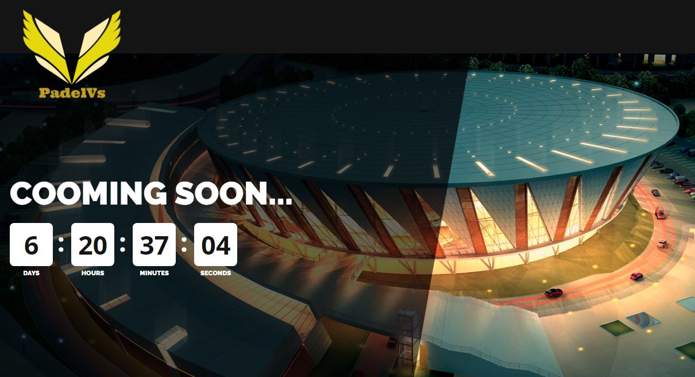
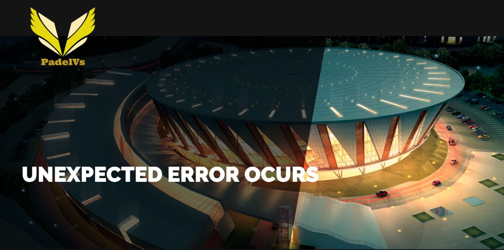
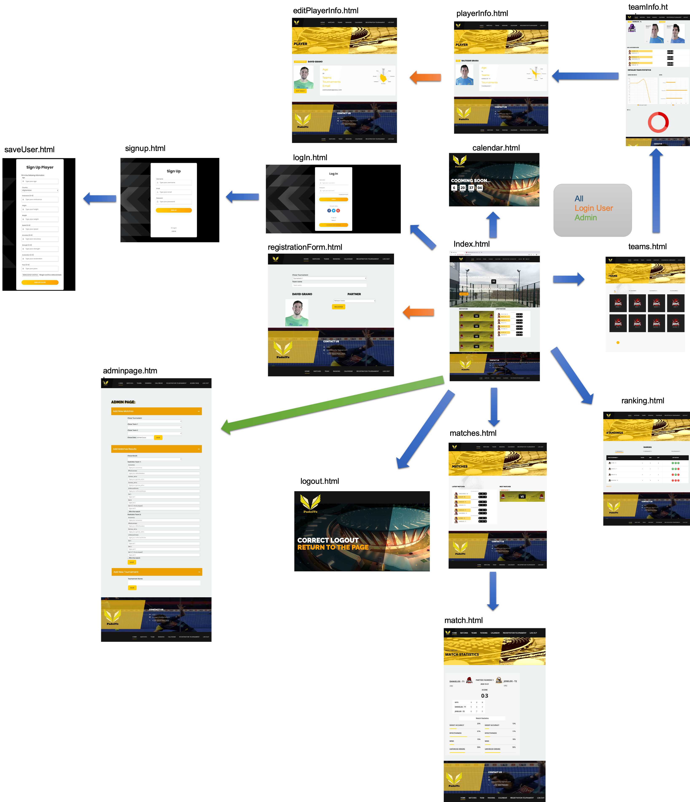
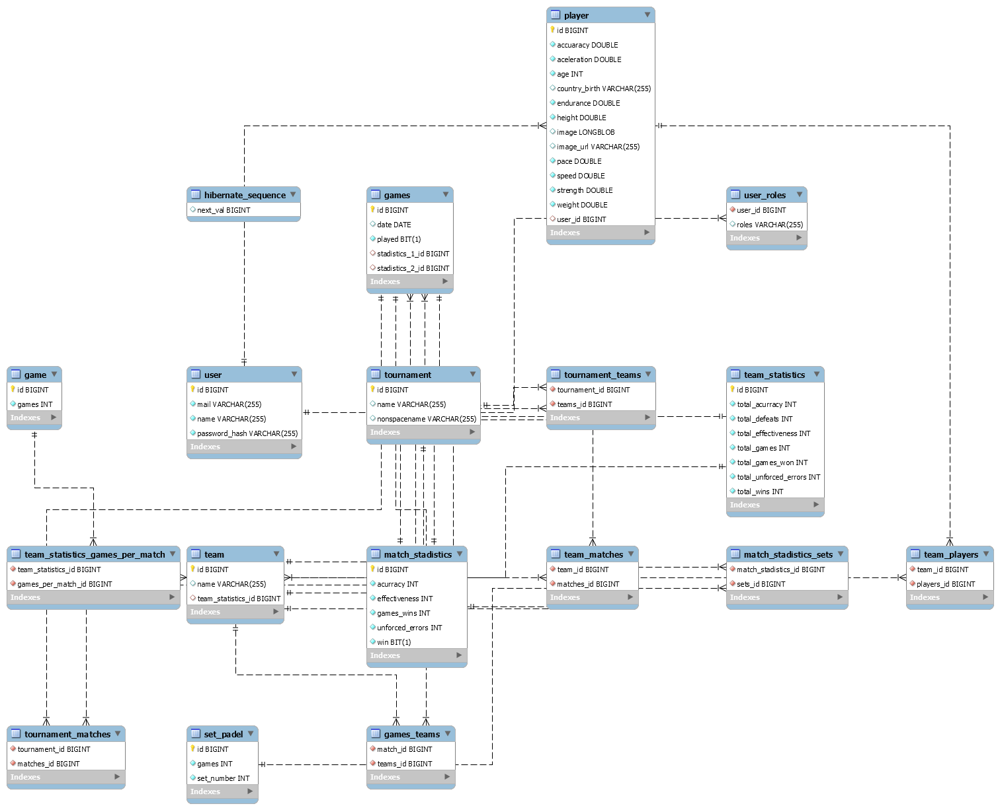
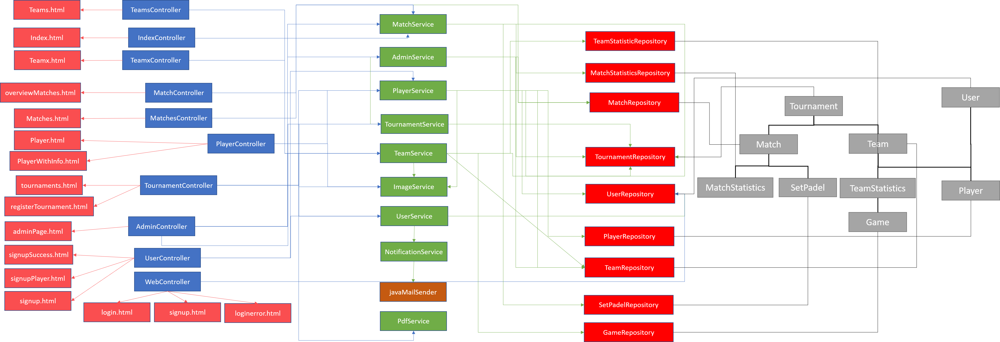

# PadelVersus
# Fase 0
### Team members

| Name | Mail | Github user|
|--------|--------|------------|
|Alejandro Checa Folguera| a.checa.2016@alumnos.urjc.es| AlexCh98 |
|Iván Martín Sanz| i.martins.2016@alumnos.urjc.es | i100van |
|José Luis Lavado Sánchez | jl.lavado.2016@alumnos.urjc.es | lujoselu98 |
|Lucas Gómez Torres | l.gomezt.2016@alumnos.urjc.es | LucasGomezTorres |
|Daniel Carmona Pedrajas | d.carmonape@alumnos.urjc.es | Dacarpe03 |

### Other tools used 
#### Trello 
https://trello.com/b/FH0qaXPJ/daw

### Sections description

#### Entities
Users, teams, tournament, game. Relations:
* Games are played by teams.
* Tournament are composed by teams.
* Teams are composed by users.

#### Users and permissions

* **Anonymous user**:Read permission over rankings, team statistics, game's calendar and other info.
* **Loged user**: All permission of Anonymous user. Write pemission over tournament registration to join them. Write permisions over his  personal and login data and his team information data. 
* **Admin user**: Read permission over all website data. Write over all website data (not login data).

#### Images

Loged users can upload images to their profile. Loged users and Admin can upload photos of the games.

#### Graphics 

Loged users can see user graphics of their statistics they can choose between diferent formats.

#### Complementary technology

* Emails sent to the players as a remainder of the game.
* Login with facebook, twitter or google.
* API REST from diferent social media used to post info and results about the games.
* API from GoogleCalendar to be able to show the matches loaded from the database.

#### Advanced Algorithmic

The webapp will implement ELO ranking system automatically calculated.

# Fase 1

### Snapshots
#### Home
This window will show you some matches of the tournament with their dates, and their places. Moreover, will show you the latest matches and the next matches and the main managers.

#### Loggin
Here, you will can log in on the site with your username and your password.

#### SignUp
Here, you will can sign up on the page, with your username, your password and your email.

#### Matches
Contains two list. One for the latest matches and another one for the next matches shown in a slider where you can navigate through next days.
#### SpecificMatch
Contains the score of the match and their  Match Statistics.

#### Teams
Contains a slider where you can navigate between tournaments to see which teams are inscribed in them.

#### SpecificTeam
A page where the team logo, the team name and its two members are shown. Below this information we find statistics about the team.

#### Player/User
This window will show you main features of the players of each team, the last five matches, the club history and the trophies. Moreover, it shows you the minutes played, one summary of the player, detailed player statistics (graphic)and his points per game (graphic).

#### Registration Tournament
You will can choose tournament, write your team name and upload team logo. Moreover, you will can write the first name (player1) and the second player will be found for join to first player.

#### Calendar
Contains one calendar with the matches of each month.

### Flow Diagram


# Fase 2
## Description of the Fase

## Top 5 Most Important Commits
| Name | Github user | Most Important | 2 | 3 | 4 | 5 |
|--------|--------|--------|--------|--------|--------|--------|
|Alejandro Checa Folguera | AlexCh98 |[Admin Page](https://github.com/CodeURJC-DAW-2019-20/PadelVersus/commit/9f20e8eea84c41ba3f46370919e08cbf6c793c26)|[Sign Up](https://github.com/CodeURJC-DAW-2019-20/PadelVersus/commit/1fc40aaa71d98cf12a075acda600d6ee86f413af)|[Automatic Email](https://github.com/CodeURJC-DAW-2019-20/PadelVersus/commit/165a8af7b312e2d231850faa3fe1fb89cfd30334)|[Log In Page](https://github.com/CodeURJC-DAW-2019-20/PadelVersus/commit/29e373af2504503ee12e07ffa6cceeb171914ca0)|[Spring Security](https://github.com/CodeURJC-DAW-2019-20/PadelVersus/commit/2f56a759a3b6f6eb5cbf58922587467ae8dea98b)
|Iván Martín Sanz| i100van |[Querys for replace filtrating](https://github.com/CodeURJC-DAW-2019-20/PadelVersus/pull/99/commits/1b85ee8a3088fe5d7b0a4f001b14fceed9ef9ca2)|[Port a MySql](https://github.com/CodeURJC-DAW-2019-20/PadelVersus/pull/94/commits/5478a687bb00bf60b6e1562ddbd051419fbc0ead)|[Loggin with FaceBook](https://github.com/CodeURJC-DAW-2019-20/PadelVersus/pull/59/commits/7e8c8814a3e0abfc990ec2a1f0778d8a1afe088e)|[OverviewMatches](https://github.com/CodeURJC-DAW-2019-20/PadelVersus/pull/61/commits/ebb38fada33539d8eedc7d311b79304ba27a9eae)|[Pageable for Teams](https://github.com/CodeURJC-DAW-2019-20/PadelVersus/pull/79)|
|José Luis Lavado Sánchez | lujoselu98 |[Tournaments](https://github.com/CodeURJC-DAW-2019-20/PadelVersus/commit/280ae432237e6b7595b751fae3dc9535d470adf6)|[Tournaments pdf](https://github.com/CodeURJC-DAW-2019-20/PadelVersus/commit/a417cf136e03161e2b1732810d60b5343fbab49a)|[Link player with users](https://github.com/CodeURJC-DAW-2019-20/PadelVersus/commit/14fd350a32320741ab33691ef119a0cb2990a489)|[Error handling](https://github.com/CodeURJC-DAW-2019-20/PadelVersus/commit/c46870b7ffadc076c9839487cd0dbb9ecc476adb)|[Navbar based on logged user](https://github.com/CodeURJC-DAW-2019-20/PadelVersus/commit/af8c2c0c555cd6252e70e32b28f32a06a7f2d11a)|
|Lucas Gómez Torres | LucasGomezTorres |[Matches Page Mustache](https://github.com/CodeURJC-DAW-2019-20/PadelVersus/commit/e26730f6ab91259798696caf017d55c2e74ca619)|[Index Page Mustache](https://github.com/CodeURJC-DAW-2019-20/PadelVersus/commit/368f9b73872e730d7205d4fad6bf45020402f3ae)|[Player_Profile](https://github.com/CodeURJC-DAW-2019-20/PadelVersus/commit/69c405b74118de66ac10e8e84dc57c707904351f)|[Player_Graphics](https://github.com/CodeURJC-DAW-2019-20/PadelVersus/commit/51ac63ceceaaab61433c9bf8c814d964d96201fb)|[Logic_Player](https://github.com/CodeURJC-DAW-2019-20/PadelVersus/commit/0d4eb3beb655b006426726f78bc1aa15d2c136fe)|
|Daniel Carmona Pedrajas | Dacarpe03 | [Team Service](https://github.com/CodeURJC-DAW-2019-20/PadelVersus/commit/a39d30ad9e38b3e6768799ccf7ec890d7cfa2f24) | [Player Profile Editing](https://github.com/CodeURJC-DAW-2019-20/PadelVersus/commit/5d5bf1b79bb99b0f7b08747cf8ac8f6fcb5f0f9c) | [Teamx Page Mustache](https://github.com/CodeURJC-DAW-2019-20/PadelVersus/commit/a5a059cf41f9a0c7d94a4f65b49077221f6c33a7) | [TeamStatistics](https://github.com/CodeURJC-DAW-2019-20/PadelVersus/commit/9fa9062167c712b516ac248fc21b69192747c70b) | [TeamEntity](https://github.com/CodeURJC-DAW-2019-20/PadelVersus/commit/676b7cf1a527192674cdf77663347693a2739b9f) |

## Files focused on
| Name | Github user | 1 | 2 | 3 | 4 | 5 |
|--------|--------|--------|--------|--------|--------|--------|
|Alejandro Checa Folguera | AlexCh98|AdminController.java|UserController.java|adminPage.html|signUp.html/logIn.html|SecurityConfiguration.java
|Iván Martín Sanz | i100van |SocialFacebookControler.java|MatchStadistics.java|overviewMatch.html|index.html|MatchStadisticsControler.java|
|José Luis Lavado Sánchez | lujoselu98 |TournamentService.java|ImageService.java|tournaments.html|registerTournament.html|PdfService.java|
|Lucas Gómez Torres | LucasGomezTorres |MatchService.java|Matches.html|index.html|PlayerController.java|Player.java|
|Daniel Carmona Pedrajas | Dacarpe03 |TeamService.java|LastMatchDisplay.java|teamx.html|Team.java|AdminController.java|

## Textual Description Of Work
| Name | Github user | Description |
|--------|--------|--------|
|Alejandro Checa Folguera | AlexCh98 |All the securityof spring boot. The log in and sign up form with their controllers. Email automatic sending when sign up and start spring boot proyect and merging the page in phase 1 with my teammates.|
|Iván Martín Sanz|  i100van |Normally tasks of use of API, application of templates Mustache, port to mySQL, and html files of matches.|
|José Luis Lavado Sánchez | lujoselu98 |Mainly task related with tournaments logic on TournamentService and display on mustache template, also logic to register team into tournament and pdf library to generate tournament ranking exportable pdf. All error handling via html for wellkonwn errors and via ``` @ControllerAdvice ``` for unexpected unhandled errors. Interceptor to generate the navbar links based on logged user. Link the player and user entity on the database at signup.|
|Lucas Gómez Torres |  LucasGomezTorres |Mainly tasks related to the player entity  such as playerController or playerService besides templating html with mustache in files as index.html or player.html, also helped on matches. |
|Daniel Carmona Pedrajas | Dacarpe03 |Mainly tasks related to the team entity such as teamController or teamService besides templating html pages with Mustache, also helped on player and admin tasks and a minor SQL query|

## Steps for making the website: 
1. Create the html template with css, js ... 
2. Create a spring project with maven and web dependencies, devtools, jpa, h2, mustache. 
3. Create in resources a static folder and another of templates. 
4. We put all our css, js, images and static elements that we already had in the static folder. 
5. We put the html in the templates folder because we will use mustache and it is the configuration that it requires. 
6. We will have to change the links to all the css, js from the html because the static address does not work, so we will have to put, for example, /css/library/bootstrap.css 
7. In the application.properties file we add: 
  a. ``` spring.mustache.suffix = .html ``` 
    i. so that mustache understands the .html files. 
  b. ``` spring.h2.console.enabled = true ```
    i. For h2 to work. 
8. We tried to make everything work. 
9. To see that the bbdd works, we load localhost: ```port / h2-console ``` and on the screen that comes out, we will have to leave everything the same changing what is in JDBC URL by jdbc: h2: mem: testdb and should connect and see the administrator of the bbdd. 
10 .The project could already be uploaded to github, because it works, even if it doesn't detect the links between html (index load only). 

### We start with the player class: 

1. We create a controller class and add the request Mapping in the controller to have the url defined. 
2. Later, we create the java class to define the entity (@Entity) in the bbdd, we put the attributes, define the id with @Id and ```java @GeneratedValue (strategy = GenerationType.IDENTITY)``` together with all the getters and setters and constructor (empty and with all the parameters minus id) 
3. We create a repository class of the previous entity, for example: 
  a. ```java public interface PlayerRepository extends JpaRepository <Player, Long> ```
4. Next, we create: 
  a. ```java public Optional <Player> findById (long id)  ```
    i. This method method in the PlayerRepository, so we can search for the Id from the class. 
5. To initialize the database with sample data we have Application implement ApplicationRunner. We add an @Autowired from each repository and initialize the values in the main method using the save method of the repository. 
6. An example we are talking about is: 
 ```java
      @GetMapping("/{id}")  
      public String player(Model model, @PathVariable Long id){  
              Optional<Player> player = playerRepository.findById(id);  
              if (player.isPresent()) {  
                  model.addAttribute("name", player.get().getUsername());  
                  return "player";  
              } else {  
                  return "404";  
              }  
      }  
```
This is what we have done with the rest of the classes to generate our bbdd scheme. 

### Highlighting the creation of security: 

  You have to add the security dependency to the pom, and after that, define a class where you set the privileges for the different roles, and the restricted pages based on each role. In addition, to specifying how to log in, and the methods that will manage this, the logout... Finally, it would be necessary to create the keystore (certificate) that is what will accredit the https page, and add in the application properties server.ssl.key-store = classpath: keystore.jks, server.ssl.key-store-password = password and server.ssl.key-password = secret 

Once everything is configured, what we will do is create the necessary queries to load our information on the page, which will be done in a java class called repository, and where each sentence will be preceded by @Query, indicating that it is a query, being an example the following: 
```java
      @Query (value = 
      "SELECT m. *" + 
      "FROM tournament_matches tm" + 
      "INNER JOIN tournament t ON tm.tournament_id = t.id" + 
      "INNER JOIN games m ON tm.matches_id = m.id" + 
      "WHERE NOT played and t.name =? 1", 
      nativeQuery = true) 
      List <Match> findNotPlayedByTournamentName (String name); 
```
Later, we will make the change from h2 to mysql, adding the dependency of mysql to the pom and removing the h2, and adding in the application properties the url, username and pass of access to the bbdd. 
Finally, if you want you can add CSRF to avoid this type of attacks, deleting in the security configuration class the line crsf.disable (); and adding in all html where there is a form the following: <input type = "hidden" name = "_ csrf" value = "{{token}}" />. In addition to a CSRF Handler class that handles the configuration. 
As we said, all this page was done with mustache, html, css, java and javascript, in addition to spring boot and Maven. 

## New templates
### Registration For a Tournament

### SignUp Form

### Admin Page

### LogOut Page

### Specific Team Page Update

### 404 Page

### Comming Soon

### Unexpected Error


## Navigation

## Entity Diagram

## Class/Template Diagram

## Demo Structure
1. Open Index.html and show all in it
2. Go to matches for consulting info of next matches
3. Go to teams and show ajax functionality
4. Go to Ranking and use save PDF
5. Go to registration tournament
6. Use sign up functionality and fill all the fields and upload a image
7. Show email fuctionality.
8. Log in.
9. Go again to registration tournament an fill the fields.
10. Show the ranking of the tournament.
11. On the ranking select the first teams, to show the graphics.
12. On the main bar, got to your profile, and change your image.
13. Log out and log in with the admin password: adminpass
14. Add a new match with the team we have made before.
15. Go to matches and show the match have been added.
16. Return to admin page and fill the data of that match.
17. Go to the ranking and show the consecuences, thats our advance consulting.
18. Go to matches and show the match is change from next matches to last matches, and go into the match overview and show that it have the data we have fill.
19. Then go to the team and show that the statistics have change.

 ## Changes:
### Complementary technology
* API from GoogleCalendar to be able to show the matches loaded from the database has been changed by the generation of a pdf with the data of a tournament.
* Emails sent to the players as a remainder of the game has been changed by an email sent when user create a new account.
* Login with facebook, twitter or google changed by a twitter collection in main page.
### Advanced Algorithms
The ELO system has been replaced by the calculation of the ranking in each update made by the admin of the games played, and advanced querys to fill the data such as:
```java
   @Query(value = "SELECT m.* " +
            "FROM tournament_matches AS tm " +
            "INNER JOIN tournament t ON tm.tournament_id = t.id " +
            "INNER JOIN(" +
            "SELECT id, date, played, stadistics_1_id, stadistics_2_id " +
            "FROM (" +
            "SELECT t.name as team_name , g.id as match_id, g.* " +
            "FROM games_teams AS gt " +
            "INNER JOIN games g ON gt.match_id = g.id " +
            "INNER JOIN team t ON gt.teams_id = t.id " +
            "WHERE t.name=?1 OR t.name=?2 " +
            "GROUP BY g.id " +
            "HAVING count(g.id)>1 " +
            ") AS joinned_table " +
            ") m ON tm.matches_id = m.id " +
            "WHERE NOT played and t.name = ?3 ",
            nativeQuery = true)
    Optional<Match> findIdByTeamsNameAndTournamentName(String t1, String t2, String tName);
  ```
